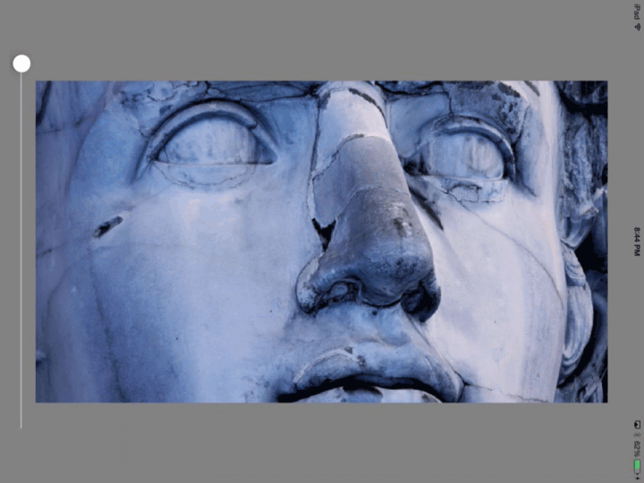

Really basic.

This repo simply holds some code to perform downsampling like one might get on various mipmap levels, achieved using a two pass (separable) box blur. Not really planning to do much with this repo, just making it public so I don't have to update my plan right now.

Note that in this example, blurring/downsampling is happening *per frame* using a CADisplayLink on the main run loop.

